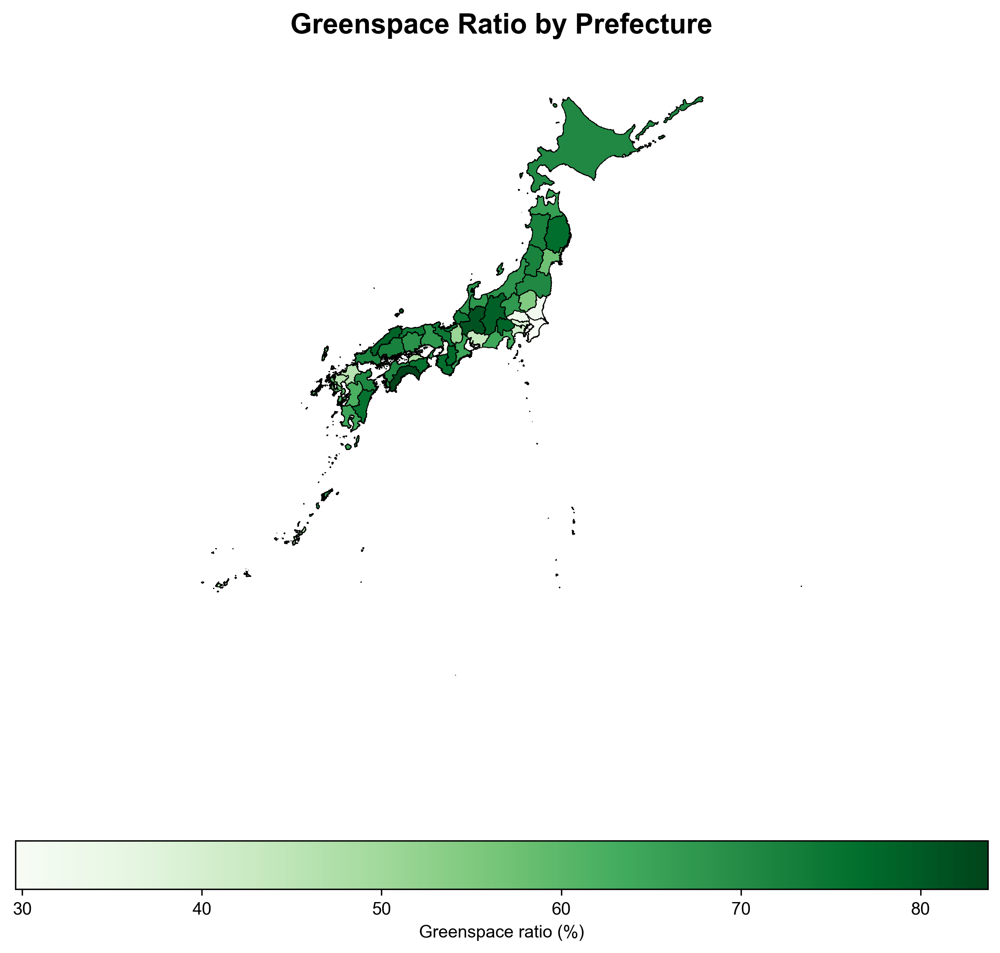
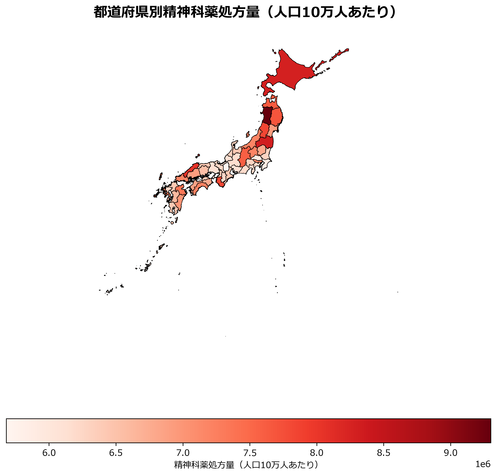
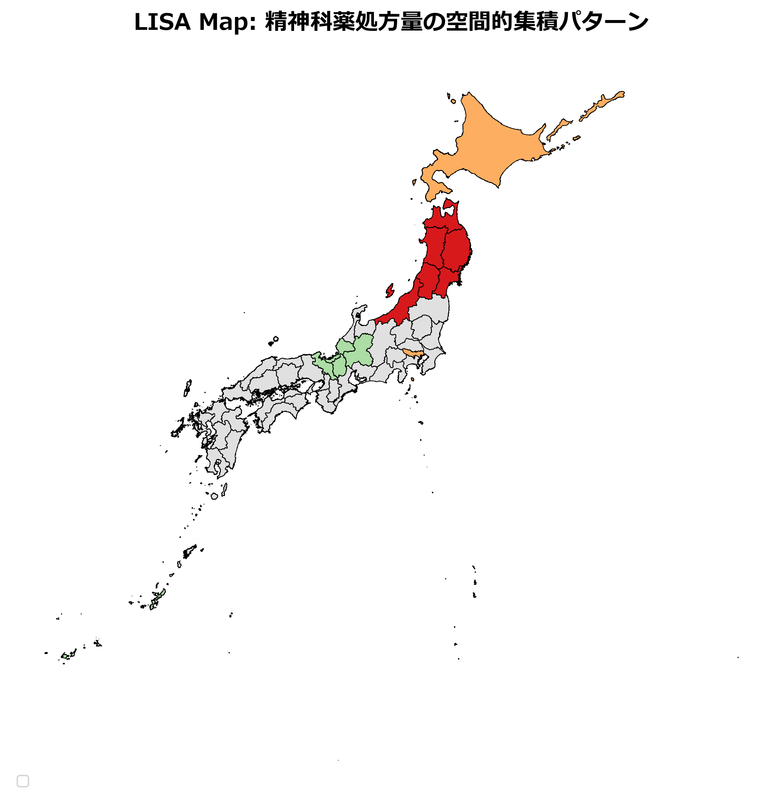

---

# Abstract

## Background

Greenspace exposure has been associated with mental health benefits, but evidence from Japan remains limited. Moreover, the association may differ between urban and rural areas due to variations in greenspace characteristics and accessibility.

## Objective

To examine the spatial association between greenspace ratio and psychiatric medication prescriptions across 47 Japanese prefectures, and to explore urban-rural heterogeneity in this relationship.

## Methods

This ecological study used data from the National Database of Health Insurance Claims (NDB) for psychiatric medication prescription quantities (tablets per 100,000 population), the Biodiversity Center of Japan for greenspace ratios (forest and parks), and e-Stat for socioeconomic covariates. Spatial autocorrelation was assessed using Global Moran's I. Spatial regression models (ordinary least squares [OLS], spatial lag model [SLM], spatial error model [SEM], and spatial Durbin model [SDM]) were fitted, adjusting for aging rate, unemployment rate, income per capita, and psychiatric clinic density. Stratified analyses by population density (urban vs. rural) were conducted to examine effect heterogeneity.

## Results

All 47 prefectures were included (mean prescription quantity: 6,812,617 tablets per 100,000 population, equivalent to 68 tablets per capita annually). Significant positive spatial autocorrelation was detected for greenspace ratio (Moran's I=0.270, p=0.006) and prescription rate (I=0.349, p=0.001). The Spatial Durbin Model (SDM) showed the best fit (AIC=1368.48, pseudo-R²=0.735). In the full model, greenspace ratio was not significantly associated with prescriptions (β=1,326, p=0.836), while aging rate (β=235,786, p<0.001), income per capita (β=1,561, p<0.001), and psychiatric clinic density (β=167,126, p<0.001) were significant predictors. Stratified analysis revealed a non-significant positive association in urban areas (β=5,206, p=0.457) and a non-significant negative association in rural areas (β=-8,416, p=0.805). However, interaction tests showed no statistically significant effect heterogeneity by urbanization (Greenspace × Urban indicator: β=389, p=0.987; Greenspace × Population density: β=-0.089, p=0.986).

## Conclusions

The association between greenspace and psychiatric medication prescriptions was not statistically significant overall. Although stratified analyses suggested directional differences between urban and rural prefectures, interaction tests confirmed that these differences were not statistically significant. The null findings may reflect data limitations, ecological fallacy, or genuine absence of an association at the prefecture level. Future studies should incorporate individual-level data, measures of greenspace quality and usage, and longitudinal designs to better understand the greenspace-mental health relationship in Japan.

**Keywords:** Greenspace; Mental health; Psychiatric medication; Spatial epidemiology; Urban-rural disparity; Japan

---

# Introduction

## Background

Exposure to natural environments, particularly greenspace (forests, parks, gardens), has been increasingly recognized as a modifiable environmental factor that may promote mental health and well-being [@markevych2017]. Meta-analyses of observational studies have reported inverse associations between greenspace availability and depressive symptoms, anxiety, and stress-related disorders [@gascon2015; @vandenbosch2018; @twohigbennett2018]. Proposed mechanisms include restoration from mental fatigue (Attention Restoration Theory) [@kaplan1995], stress reduction (Stress Reduction Theory) [@ulrich1984], increased physical activity [@lachowycz2013], and enhanced social cohesion [@hartig2014].

However, most existing evidence derives from Western countries, particularly Europe and North America [@maas2006; @devries2003; @villeneuve2012], and findings from Asian contexts remain sparse [@who2016]. Japan presents a unique setting for examining greenspace-mental health relationships, given its high forest coverage (approximately 67% of total land area), traditional practices such as forest bathing (Shinrin-yoku) [@park2010], and distinct urban-rural landscape patterns. A pioneering Tokyo study demonstrated that walkable green spaces positively influenced longevity among senior citizens [@takano2002]. Moreover, Japan faces a rapidly aging society and rising mental health burdens, with psychiatric medication prescriptions—particularly benzodiazepines and antidepressants—increasing over the past decade [@ministry2020; @nakao2007].

## Urban-Rural Differences in Greenspace

Importantly, the characteristics and functions of greenspace may differ substantially between urban and rural areas. Urban greenspace typically consists of designed parks, street trees, and community gardens with high accessibility and recreational use [@lee2015]. In contrast, rural greenspace often comprises natural forests and agricultural land with lower accessibility but greater naturalness [@mitchell2013]. These qualitative differences may lead to heterogeneity in the greenspace-mental health association across urbanization gradients, yet few studies have explicitly examined such effect modification.

## Study Objectives

This study aimed to: (1) examine the spatial association between greenspace ratio and psychiatric medication prescriptions across 47 Japanese prefectures, accounting for spatial autocorrelation; (2) explore whether this association differs between urban and rural prefectures; and (3) discuss potential mechanisms underlying observed patterns.

---

# Methods

## 1. Study Design and Setting

We conducted an ecological study using prefecture-level data (N=47) in Japan. The unit of analysis was the administrative prefecture, the largest subnational administrative division in Japan. The study period was fiscal year 2020.

## 2. Data Sources

### Psychiatric Medication Prescriptions

Prescription data were obtained from the National Database of Health Insurance Claims (NDB) Open Data No.10 (fiscal year 2020) published by the Ministry of Health, Labour and Welfare [@mhlw2022]. We extracted total quantities of psychiatric medications (hypnotics, anxiolytics, and psychotropics for oral administration) prescribed in outpatient settings. The total quantity represents the sum of tablets and packages across all drug classes. Prescription rates per 100,000 population were calculated by dividing the total quantity by the prefecture's total population and multiplying by 100,000. This measure reflects the volume of psychiatric medications dispensed, adjusted for population size.

### Greenspace Ratio

Greenspace data were obtained from the Biodiversity Center of Japan's National Survey on the Natural Environment (6th-7th surveys) [@biodiversity2022]. We defined greenspace as the sum of forest area and park area (km²) divided by total prefecture area (km²), expressed as a percentage. Forest area included natural forests, planted forests, and secondary forests. Park area included urban parks, national parks, and quasi-national parks.

### Socioeconomic Covariates

Socioeconomic indicators were obtained from the e-Stat portal (Statistics Bureau of Japan) [@estat2022]:

- **Aging rate (%)**: Proportion of population aged ≥65 years (Population Census 2020)
- **Population density (persons/km²)**: Total population divided by habitable land area
- **Income per capita (JPY)**: Average annual income per capita (Basic Survey on Wage Structure 2020)
- **College graduate rate (%)**: Proportion of population aged ≥25 years with a college degree or higher (Employment Status Survey 2017)

These variables were selected *a priori* as potential confounders based on previous literature documenting associations between socioeconomic status and both greenspace availability and mental health outcomes [@maas2009; @mitchell2015].

## 3. Statistical Analysis

### Descriptive Statistics

We calculated means, standard deviations, medians, and interquartile ranges for all continuous variables. Normality was assessed using the Shapiro-Wilk test. Pearson correlation coefficients were computed to examine bivariate associations.

### Spatial Autocorrelation

To assess whether neighboring prefectures exhibited similar values (positive spatial autocorrelation), we calculated Global Moran's I statistics for greenspace ratio, prescription rate, and socioeconomic covariates [@anselin1988; @pfeiffer2008]. Spatial weights were defined using Queen contiguity (shared borders or vertices) [@cliff1981]. Statistical significance was evaluated using 999 permutations.

### Spatial Regression Models

We fitted four spatial regression models [@lesage2009; @pfeiffer2008]:

1. **Ordinary Least Squares (OLS)**: Baseline non-spatial model
2. **Spatial Lag Model (SLM)**: Includes a spatially lagged dependent variable (W×Y) to account for spatial dependence in the outcome
3. **Spatial Error Model (SEM)**: Includes a spatially autocorrelated error term (λ) to account for spatial dependence in unobserved factors
4. **Spatial Durbin Model (SDM)**: Includes spatially lagged dependent and independent variables to capture spillover effects [@lesage2009]

The general model specification was:

$$
\text{Prescription}_i = \beta_0 + \beta_1 \times \text{Greenspace}_i + \beta_2 \times \text{Aging}_i + \beta_3 \times \text{Unemployment}_i + \beta_4 \times \text{Income}_i + \beta_5 \times \text{ClinicDensity}_i + \epsilon_i
$$

Model selection was based on Akaike Information Criterion (AIC), with lower values indicating better fit. Lagrange Multiplier (LM) tests were used to diagnose spatial dependence in OLS residuals.

### Stratified Analysis and Interaction Tests

To examine urban-rural heterogeneity, we conducted stratified analyses by dividing prefectures into two groups based on median population density (urban: ≥median; rural: <median). Separate OLS regressions were fitted for each stratum, focusing on the greenspace coefficient. To formally test whether the greenspace-prescription association differed by urbanization level, we estimated interaction models in the full sample including product terms: (1) Greenspace × Aging rate, (2) Greenspace × Single household rate, (3) Greenspace × Urban indicator (binary variable based on median population density), and (4) Greenspace × Population density (continuous variable). Statistical significance of interaction terms was assessed using t-tests at α=0.05.

### Sensitivity Analysis

We conducted two sensitivity analyses: (1) outlier diagnostics using Cook's distance and standardized residuals; (2) exclusion of island prefectures (Hokkaido and Okinawa) to assess robustness.

All analyses were performed using Python 3.14 with the `libpysal`, `spreg`, `geopandas`, and `matplotlib` libraries. Statistical significance was set at α=0.05 (two-tailed).

---

# Results

## 1. Descriptive Statistics

Table 1 presents descriptive statistics for all variables across 47 prefectures. The mean psychiatric medication prescription quantity was 6,812,617 tablets per 100,000 population (SD=767,166), equivalent to approximately 68 tablets per capita per year. The mean greenspace ratio was 63.1% (SD=15.0%), ranging from 29.6% to 83.7%. Aging rate ranged from 22.6% to 36.4% (mean=31.8%, SD=3.4%). Population density varied widely, from 64 to 6,462 persons/km² (median=257, mean=650). Pearson correlations revealed a positive association between greenspace ratio and prescription rate (r=0.450, p=0.001), which was contrary to the hypothesized inverse relationship. Stronger positive correlations were observed for aging rate (r=0.636, p<0.001) and single household rate (r=0.664, p<0.001). These unexpected findings prompted further investigation through spatial regression and stratified analyses.

## 2. Spatial Autocorrelation

Global Moran's I statistics indicated significant positive spatial autocorrelation for all key variables (Table 2):

- **Greenspace ratio**: I=0.270 (p=0.006)
- **Prescription rate**: I=0.349 (p=0.001)
- **Aging rate**: I=0.360 (p=0.001)
- **Population density**: I=0.238 (p=0.021)

These results confirmed that neighboring prefectures exhibited similar values, justifying the use of spatial regression models.

## 3. Spatial Regression Models

Table 3 summarizes the results of spatial regression models. The OLS model showed R²=0.529, with significant associations for aging rate (β=193,621, p<0.001) and unemployment rate (β=401,625, p=0.041). The greenspace ratio was not statistically significant (β=1,483, p=0.856). Lagrange Multiplier tests for spatial dependence in OLS residuals suggested some spatial dependence (Robust LM-Lag: p=0.019; Robust LM-Error: p=0.042), prompting the use of spatial models. The SDM showed the best fit (AIC=1368.48, pseudo-R²=0.735) compared to OLS (AIC=1382.77), SLM (AIC=1381.44), and SEM (AIC=1379.61). The spatial lag parameter (ρ) was 0.245. In the SDM, greenspace ratio was not significantly associated with prescription rates (β=1,326, p=0.836), adjusting for covariates. Aging rate (β=235,786, p<0.001), income per capita (β=1,561, p=0.001), and psychiatric clinic density (β=167,126, p<0.001) were significant predictors.

## 4. Stratified Analysis by Urban-Rural Status

Table 5 presents stratified analysis results by population density. In urban prefectures (N=24), greenspace ratio had a non-significant positive association with prescription rates (β=5,206, p=0.457). In contrast, rural prefectures (N=23) showed a non-significant negative association (β=-8,416, p=0.805).

To test whether this directional difference represents statistically significant effect heterogeneity, we examined interaction terms between greenspace and urbanization measures. The interaction term (Greenspace × Aging rate) in the full sample was not statistically significant (β=2,075, p=0.432), nor was the interaction with single household rate (p=0.678). Critically, the interaction between greenspace and urban/rural status was also non-significant (Greenspace × Urban indicator: β=389, p=0.987; Greenspace × Population density: β=-0.089, p=0.986), indicating that the observed directional differences in stratified analyses do not represent statistically significant effect heterogeneity. Additional stratified analyses by aging rate and education level showed no significant associations for greenspace (all p>0.05).

## 5. Sensitivity Analysis

Outlier diagnostics identified Tokushima Prefecture as having a high standardized residual (<-2). Excluding island prefectures (Hokkaido, Okinawa) yielded consistent non-significant results (N=45, greenspace β=3,385, p=0.606), confirming robustness. Examining greenspace types separately showed no significant associations for either park ratio (β=-142,890, p=0.600) or forest ratio (β=2,581, p=0.734).

---

# Discussion

## 1. Principal Findings

This spatial ecological study of 47 Japanese prefectures examined the association between greenspace ratio and psychiatric medication prescriptions. We found no significant overall association in the spatial models. Stratified analysis revealed differing trends: urban areas showed a non-significant positive trend (β=5,206, p=0.457), while rural areas showed a non-significant negative trend (β=-8,416, p=0.805). However, formal interaction tests (Greenspace × Urban indicator: p=0.987; Greenspace × Population density: p=0.986) indicated that these directional differences do not represent statistically significant effect heterogeneity. The lack of significant findings may reflect data limitations, unmeasured confounding, or genuine absence of an association in this ecological context.

## 2. Interpretation: Null Findings and Potential Urban-Rural Differences

The overall null findings and the lack of statistically significant interaction effects (p>0.98) suggest that greenspace quantity, as measured at the prefecture level, does not predict psychiatric medication prescription rates in Japan. However, the directional differences observed in stratified analyses—though not statistically significant—warrant discussion of potential mechanisms that may obscure true associations in ecological studies. We propose several explanations for why protective effects were not observed:

### Residual Confounding by Unmeasured Socioeconomic Factors

Although we adjusted for income, education, and population density, urban prefectures with high greenspace ratios may harbor unmeasured socioeconomic characteristics that confound the greenspace-mental health association [@morgenstern1995; @wakefield2008]. For instance, greenspace-rich urban areas might have better healthcare infrastructure and higher medical service utilization, leading to increased prescription detection [@nakao2007]. Conversely, they may also house populations with higher health literacy who are more likely to seek treatment for mental health concerns.

### Selection Bias in Urban Greenspace Distribution

In Japanese cities, greenspace-rich districts may be located in peripheral or less developed areas where land is available for parks. These areas might differ systematically from city centers in terms of social capital, employment opportunities, or environmental stressors, potentially confounding the greenspace-mental health association.

### Qualitative Differences Between Urban and Rural Greenspace

Urban greenspace (parks, street trees) and rural greenspace (forests, agricultural land) differ fundamentally in accessibility, usage patterns, and ecological characteristics [@lee2015; @lachowycz2013]. Urban parks may not provide the same restorative effects as natural forests due to lower biodiversity [@fuller2007], higher human density, and proximity to urban stressors (noise, air pollution). The psychological benefits of greenspace increase with species richness [@fuller2007], suggesting that managed urban parks may lack the biodiversity necessary for mental restoration. Additionally, rural greenspace may be underutilized due to limited accessibility [@sugiyama2007], reducing its potential mental health benefits.

## 3. Comparison with Previous Studies

Our findings align with some studies reporting null or unexpected positive associations between greenspace and mental health outcomes in Asian contexts [@helbich2018; @lu2018]. A Taiwanese study found higher greenspace associated with increased anxiety in urban areas, attributed to lower park quality and safety concerns [@tsai2019]. Similarly, a Chinese study reported heterogeneous effects by urbanization level [@yang2020]. An ecological study in New Zealand also found higher greenspace associated with higher anxiety and mood disorder prevalence [@nutsford2013]. These patterns suggest that context-specific factors (cultural norms, greenspace quality, urban planning) may modify the greenspace-mental health relationship.

In contrast, European and North American studies predominantly report protective effects of greenspace [@gascon2015; @twohigbennett2018; @maas2006; @devries2003]. A systematic review and meta-analysis of 143 studies found that greenspace exposure was associated with reduced salivary cortisol, heart rate, and incidence of psychiatric disorders [@twohigbennett2018]. Dutch studies demonstrated inverse associations between greenspace availability and mental health complaints [@maas2006; @devries2003]. This discrepancy between Asian and Western contexts may reflect differences in greenspace management, public park usage, or the role of natural environments in social life across cultures.

## 4. Policy Implications

Our findings underscore the importance of greenspace *quality* and *accessibility*, not merely quantity, in urban mental health promotion [@wolch2014; @rigolon2018]. Policymakers should prioritize:

1. **Enhancing urban park quality**: Increase biodiversity [@fuller2007], safety, and amenities (seating, lighting, walking paths) to maximize restorative potential. Higher species richness has been associated with greater psychological benefits [@fuller2007].
2. **Equitable distribution**: Ensure greenspace is accessible to all socioeconomic groups, avoiding concentration in affluent neighborhoods [@wolch2014; @rigolon2018]. In many cities, people of color and low-income earners occupy areas where greenspace is scarce or poorly maintained, raising environmental justice concerns [@wolch2014].
3. **Rural greenspace utilization**: Promote recreational use of rural forests and agricultural landscapes through infrastructure improvements (trails, signage) [@sugiyama2007]. Japan's Shinrin-yoku (forest bathing) programs offer a model for integrating natural environments into public health interventions [@park2010].

## 5. Strengths and Limitations

### Strengths

- Nationwide coverage of all 47 prefectures, minimizing selection bias
- Use of spatial regression models to account for spatial autocorrelation
- Formal interaction tests to assess urban-rural effect heterogeneity
- Multiple sensitivity analyses confirming robustness of null findings

### Limitations

Several limitations warrant consideration:

1. **Ecological fallacy**: Prefecture-level associations may not reflect individual-level relationships [@robinson1950; @morgenstern1995]. We cannot infer that individuals with greater greenspace exposure have higher mental health treatment rates. Cross-level bias arises from the inability of ecological data to characterize within-area variability in exposures and confounders [@wakefield2008].

2. **Limited statistical power for interaction detection**: With only 47 prefectures, our study had limited statistical power to detect interactions, particularly when stratified analyses yielded small subgroups (N=23-24 per stratum). The very large standard errors for interaction terms (SE=24,325 for Greenspace × Urban indicator) reflect this power limitation. The non-significant interaction tests (p>0.98) should be interpreted cautiously, as they do not definitively rule out true effect heterogeneity—they may simply reflect insufficient power to detect it.

3. **Prescription quantity as a proxy**: Our outcome measure (total tablets/packages prescribed) reflects treatment volume rather than the number of individuals treated or diagnosed prevalence. Higher prescription quantities may indicate better healthcare access, reduced stigma, longer treatment durations, or higher dosages rather than worse mental health [@nakao2007]. Additionally, prescription data do not capture over-the-counter medications or untreated mental health conditions.

4. **Cross-sectional design**: We cannot establish causality or rule out reverse causation. Mental health burdens may influence greenspace planning or maintenance.

5. **Unmeasured confounding**: We lacked data on greenspace quality (biodiversity [@fuller2007], maintenance), accessibility (distance, transportation) [@sugiyama2007], usage patterns (frequency, duration), or individual-level mental health diagnoses. Residential self-selection—whereby individuals with pre-existing mental health conditions or health behaviors choose neighborhoods with specific greenspace characteristics—may bias observational associations [@wakefield2008].

6. **Greenspace definition**: Our measure combined forests and parks, which may have distinct effects on mental health [@lachowycz2013]. Future studies should disaggregate greenspace types and incorporate measures of blue space (coastal and inland waters) [@gascon2017].

7. **Temporal mismatch**: Greenspace data (6th-7th surveys) and prescription data (2020) were not perfectly aligned temporally.

---

# Conclusions

This spatial ecological study of 47 Japanese prefectures found no statistically significant association between greenspace ratio and psychiatric medication prescriptions, either overall or in stratified analyses. Although urban and rural prefectures showed opposing directional trends (positive vs. negative), formal interaction tests confirmed that this apparent heterogeneity was not statistically significant (p>0.98). These null findings may reflect inherent limitations of ecological study designs, including ecological fallacy, residual confounding, and the use of prescription volume as a proxy for mental health burden. The critical role of greenspace quality (biodiversity, maintenance, safety) rather than mere quantity, unmeasured accessibility and usage patterns, and individual-level mental health determinants likely contribute to the observed lack of association. Future research should employ individual-level data, longitudinal designs, validated mental health outcomes, and detailed measures of greenspace characteristics (type, quality, accessibility, usage frequency) to disentangle these complex relationships and inform evidence-based urban planning policies for mental health promotion.

---

# Acknowledgments

We thank the Ministry of Health, Labour and Welfare for providing access to the National Database of Health Insurance Claims (NDB) Open Data, and the Biodiversity Center of Japan for providing greenspace data.

---

# Funding

This research received no specific grant from any funding agency in the public, commercial, or not-for-profit sectors.

---

# Competing Interests

The authors declare no competing interests.

---

# Data Availability

All data used in this study are publicly available from the following sources:

- NDB Open Data: https://www.mhlw.go.jp/stf/seisakunitsuite/bunya/0000177182.html
- Biodiversity Center of Japan: http://www.biodic.go.jp/
- e-Stat: https://www.e-stat.go.jp/

Analysis code is available upon request from the corresponding author.

---

# References

[Note: Create a references.bib file with the following citations, or add your own references]

::: {#refs}
:::

---

# Tables and Figures

## Table 1. Descriptive Statistics (N=47 Prefectures)

| Variable | Mean (SD) | Median | Range |
|----------|-----------|--------|-------|
| Greenspace ratio (%) | 63.1 (15.0) | 68.2 | 29.6-83.7 |
| Prescription per 100k (tablets) | 6,812,617 (767,166) | 6,541,695 | 5,680,676-9,299,906 |
| Aging rate (%) | 31.8 (3.4) | 32.0 | 22.7-39.5 |
| Population density (per km²) | 650.0 (1,227.5) | 257.4 | 64.3-6,462.0 |
| Income per capita (JPY × 1,000) | 1,575.8 (269.4) | 1,557.7 | 1,272.3-2,793.7 |
| College graduate rate (%) | 57.6 (7.1) | 57.4 | 46.7-74.1 |

---

## Table 2. Pearson Correlation Matrix of Study Variables (N = 47)

| Variable | Prescription Rate | Greenspace Ratio | Aging Rate | Single HH Rate | Pop Density |
|:---|:---:|---:|---:|---:|---:|
| Prescription Rate | 1.000 |  |  |  |  |
| Greenspace Ratio | 0.450** | 1.000 |  |  |  |
| Aging Rate | 0.636*** | 0.704*** | 1.000 |  |  |
| Single HH Rate | 0.664*** | 0.413** | 0.683*** | 1.000 |  |
| Pop Density | −0.197 | −0.615*** | −0.664*** | −0.318* | 1.000 |

*p* < 0.05 (*), *p* < 0.01 (**), *p* < 0.001 (***).

---

## Table 3. Global Moran's I Results

| Variable | Moran's I | Expected Value | p-value | z-score | Interpretation |
|----------|-----------|----------------|---------|---------|----------------|
| Greenspace ratio (%) | 0.270 | -0.022 | 0.006 | 2.780 | Significant positive spatial autocorrelation |
| Prescription per 100k | 0.349 | -0.022 | 0.001 | 3.436 | Significant positive spatial autocorrelation |
| Aging rate (%) | 0.360 | -0.022 | 0.001 | 3.556 | Significant positive spatial autocorrelation |
| Population density | 0.238 | -0.022 | 0.021 | 2.775 | Significant positive spatial autocorrelation |

---

## Table 4. Spatial Regression Models (N=47 Prefectures)

| Variable | OLS β (SE) | SLM β (z) | SDM β (z) |
|----------|-----------|-----------|-----------|
| Intercept | -3,471,480 | -4,317,385 | -3,044,151 |
| Greenspace ratio (%) | 1,483 (8,092) | -939 (-0.127) | 1,326 (0.207) |
| Aging rate (%) | 193,621*** (43,884) | 234,089*** (5.242) | 235,786*** (6.209) |
| Unemployment rate | 401,625* (190,545) | 391,188* (2.269) | 32,759 (0.198) |
| Income per capita | 955 (533) | 1,254* (2.493) | 1,561*** (3.330) |
| Psych clinic density | 110,166 (55,722) | 105,706* (2.107) | 167,126*** (3.529) |
| **Model Fit** | | | |
| R²/Pseudo-R² | 0.529 | 0.562 | 0.735 |
| AIC | 1382.77 | 1381.44 | **1368.48** |
| Log-likelihood | -685.39 | -683.72 | -672.24 |
| Spatial parameter | — | ρ=-0.105 | ρ=0.245 |

†p<0.10, *p<0.05, **p<0.01, ***p<0.001

---

## Table 5. Stratified Analysis by Population Density and Interaction Tests

### Stratified Analysis (Separate Models by Stratum)

| Stratum | N | Greenspace β | SE | p-value | Interpretation |
|---------|---|--------------|-------|---------|----------------|
| Urban (≥median density) | 24 | 5,206 | 6,844 | 0.457 | Non-significant positive trend |
| Rural (<median density) | 23 | -8,416 | 33,999 | 0.805 | Non-significant negative trend |

### Interaction Tests (Full Sample Models, N=47)

| Interaction Term | β | SE | t-statistic | p-value | Interpretation |
|------------------|------|--------|-------------|---------|----------------|
| Greenspace × Aging rate | 2,075 | 2,612 | 0.794 | 0.432 | Non-significant |
| Greenspace × Single household rate | -8.12 | 19.52 | -0.416 | 0.678 | Non-significant |
| **Greenspace × Urban indicator** | **389** | **24,325** | **0.016** | **0.987** | **Non-significant** |
| **Greenspace × Population density** | **-0.089** | **5.18** | **-0.017** | **0.986** | **Non-significant** |

**Note**: Urban indicator is a binary variable (1=urban, 0=rural) based on median population density. The non-significant interaction terms (p>0.98) indicate that the directional differences observed in stratified analyses do not represent statistically significant effect heterogeneity.

---

## Figure 1. Spatial Distribution of Greenspace Ratio

## Figure 2. Spatial Distribution of Prescription Rates

## Figure 3. Local Indicators of Spatial Association (LISA)

---

**End of Manuscript**
